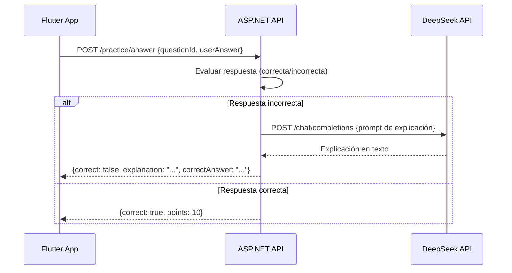
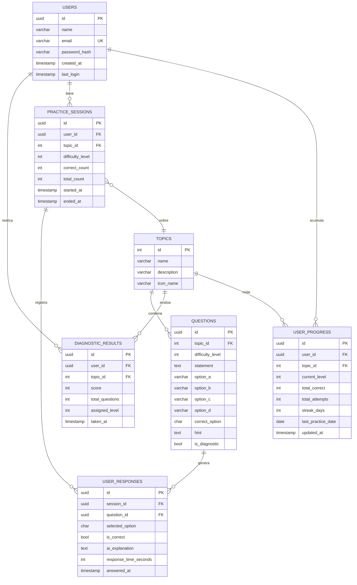
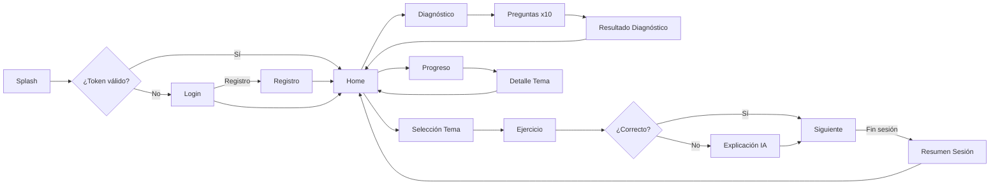

# Plan: EduCoach — App Móvil ODS 4 · Educación de Calidad

## Context
Proyecto universitario (TCC) de desarrollo móvil alineado con el ODS 4 de la ONU.  
El equipo (CIPA) necesita diseñar, documentar y prototipar una app móvil funcional en un semestre.  
La app se llama **EduCoach** y busca reforzar matemáticas básicas en estudiantes de secundaria sin acceso a tutorías privadas.  
Stack: Flutter · ASP.NET Core · PostgreSQL (ya disponible) · DeepSeek API · Render (deploy).

---

## FASE 1 — VALIDACIÓN DE LA IDEA

### Evaluación General
La idea es **sólida y ejecutable** para un semestre universitario. El problema está bien contextualizado, el alcance es realista y el stack elegido es maduro. A continuación los puntos críticos.

### Fortalezas
- Problema real y verificable con datos (bajo rendimiento en matemáticas en secundaria)
- Alcance delimitado (4 temas, 1 tipo de usuario, flujo lineal)
- Stack conocido (Flutter + ASP.NET Core es una combinación común)
- BD ya disponible: elimina fricción de despliegue
- DeepSeek API es accesible y de bajo costo vs. OpenAI

### Riesgos detectados y mitigaciones

| Riesgo | Severidad | Mitigación |
|--------|-----------|------------|
| Dependencia de internet para IA | Alta | La app funciona sin IA; la IA es un plus, no el núcleo |
| Latencia de DeepSeek en móvil | Media | Mostrar spinner + timeout de 10s; respuesta en caché si es pregunta repetida |
| Scope creep ("y si añadimos video...") | Alta | Documento de alcance firmado por el equipo antes de codificar |
| Tiempo de desarrollo ajustado | Media | MVP con solo 4 pantallas mínimas; funcionalidades extra solo si hay tiempo |
| Seguridad de credenciales BD | Alta | Nunca poner la cadena de conexión en el cliente Flutter; solo en el backend |
| Calidad de preguntas generadas | Media | Banco de preguntas predefinidas; IA solo para explicaciones, no para generar preguntas |

### Complejidades ocultas
1. **Algoritmo de diagnóstico**: definir reglas claras de qué score clasifica al usuario como "débil/medio/fuerte" en cada tema.
2. **Adaptación de dificultad**: necesita una lógica simple pero consistente (ej: 3 aciertos seguidos → subir dificultad).
3. **Gestión de tokens DeepSeek**: cada llamada a IA tiene costo. Limitar a máx 1 llamada por respuesta incorrecta.
4. **Estado offline**: si no hay internet, la app no debe romperse. Separar flujos online/offline.

### Veredicto sobre el MVP
**Sí es adecuado para un semestre.** El alcance propuesto cubre exactamente los entregables académicos (documento de requerimientos, ERD, prototipo funcional de al menos 3 pantallas, presentación). Se recomienda reducir los temas matemáticos a **2 en el MVP** (fracciones + álgebra básica) para no dispersar esfuerzo.

---

## FASE 2 — DEFINICIÓN FUNCIONAL

### Objetivo General
Desarrollar una aplicación móvil de refuerzo académico en matemáticas para estudiantes de secundaria, que identifique sus debilidades mediante una prueba diagnóstica y genere ejercicios personalizados con retroalimentación asistida por IA.

### Objetivos Específicos
1. Permitir el registro e inicio de sesión seguro del estudiante.
2. Evaluar el nivel inicial del estudiante en temas matemáticos mediante una prueba diagnóstica.
3. Generar ejercicios de práctica organizados por tema y nivel de dificultad.
4. Proporcionar retroalimentación sobre respuestas incorrectas con apoyo de DeepSeek.
5. Mostrar el progreso académico del estudiante con métricas visuales simples.

### Alcance (IN SCOPE)
- Registro y login de estudiante
- Prueba diagnóstica por tema (fracciones, álgebra básica)
- Práctica de ejercicios con 3 niveles de dificultad (básico, intermedio, avanzado)
- Retroalimentación IA al responder mal (explicación del procedimiento correcto)
- Dashboard de progreso (% de aciertos por tema, racha de práctica)
- Historial de sesiones de práctica

### Fuera de Alcance (OUT OF SCOPE)
- Chat libre tipo ChatGPT
- Videollamadas o tutores en línea
- Foros o comunidad
- Gamificación compleja (insignias, ranking global)
- Sistema de pagos o suscripción
- Notificaciones push
- Soporte multi-idioma
- Contenido de otras materias (solo matemáticas)
- Generación dinámica de preguntas por IA (las preguntas vienen de un banco predefinido)

### Público Objetivo
- **Primario**: Estudiantes de secundaria (12–17 años) con dificultades en matemáticas
- **Secundario**: Docentes que quieran recomendar la herramienta a sus alumnos

### Casos de Uso

```
CU-01: Registrarse
CU-02: Iniciar sesión
CU-03: Realizar prueba diagnóstica
CU-04: Ver resultado del diagnóstico
CU-05: Iniciar sesión de práctica por tema
CU-06: Responder ejercicio
CU-07: Ver explicación IA de respuesta incorrecta
CU-08: Ver progreso general
CU-09: Cerrar sesión
```

### Historias de Usuario (MVP)

```
HU-01: Como estudiante, quiero registrarme con nombre, email y contraseña para tener mi perfil.
HU-02: Como estudiante, quiero iniciar sesión para acceder a mis datos personalizados.
HU-03: Como estudiante, quiero hacer una prueba diagnóstica para que la app conozca mi nivel.
HU-04: Como estudiante, quiero ver un resumen de mi diagnóstico para entender mis debilidades.
HU-05: Como estudiante, quiero practicar ejercicios del tema que necesito reforzar.
HU-06: Como estudiante, quiero ver por qué me equivoqué para aprender del error.
HU-07: Como estudiante, quiero ver mi progreso acumulado para sentir avance.
```

### Requerimientos Funcionales

| ID | Descripción |
|----|-------------|
| RF-01 | El sistema debe permitir registrar un estudiante con nombre, email y contraseña |
| RF-02 | El sistema debe autenticar al usuario mediante JWT |
| RF-03 | El sistema debe presentar una prueba diagnóstica de 10 preguntas (5 por tema) |
| RF-04 | El sistema debe clasificar al usuario en nivel básico/intermedio/avanzado por tema |
| RF-05 | El sistema debe ofrecer ejercicios filtrados por tema y nivel de dificultad |
| RF-06 | El sistema debe registrar si la respuesta fue correcta o incorrecta |
| RF-07 | Ante respuesta incorrecta, el sistema debe llamar a DeepSeek para obtener explicación |
| RF-08 | El sistema debe mostrar el procedimiento correcto en lenguaje simple |
| RF-09 | El sistema debe actualizar el nivel de dificultad tras 3 aciertos consecutivos |
| RF-10 | El sistema debe mostrar un dashboard con % de aciertos por tema y racha diaria |

### Requerimientos No Funcionales

| ID | Descripción |
|----|-------------|
| RNF-01 | La app debe funcionar en Android 8.0+ y iOS 13+ |
| RNF-02 | El tiempo de respuesta de la API (sin IA) debe ser < 1 segundo |
| RNF-03 | La llamada a DeepSeek debe tener timeout de 10 segundos con mensaje de error amigable |
| RNF-04 | Las contraseñas deben almacenarse con hash bcrypt |
| RNF-05 | La comunicación entre app y backend debe usar HTTPS |
| RNF-06 | El token JWT debe expirar en 24 horas |
| RNF-07 | La app debe funcionar sin IA activa (modo degradado) |
| RNF-08 | La interfaz debe ser legible en pantallas de 5" o más |
| RNF-09 | El banco de preguntas debe tener mínimo 20 preguntas por tema y nivel |

---

## FASE 3 — MODELO DE NEGOCIO Y ODS

### Contribución al ODS 4
El ODS 4 busca "garantizar una educación inclusiva, equitativa y de calidad y promover oportunidades de aprendizaje durante toda la vida para todos."

EduCoach impacta directamente en:
- **Meta 4.1**: Asegurar que todos los niños completen la educación secundaria → la app reduce la brecha en matemáticas que genera deserción.
- **Meta 4.4**: Aumentar competencias técnicas y profesionales → matemáticas son base de cualquier carrera STEM.
- **Meta 4.5**: Eliminar disparidades de género y situación económica → la app es gratuita y accesible desde cualquier smartphone.

### Problema Específico Atacado
> "Estudiantes de secundaria en zonas urbanas y rurales con bajos recursos no tienen acceso a tutorías privadas de matemáticas, lo que profundiza las brechas de aprendizaje y aumenta el riesgo de bajo rendimiento o deserción escolar."

**Datos de contexto para la presentación:**
- Según la UNESCO, más del 50% de estudiantes en América Latina no alcanzan niveles mínimos de competencia matemática.
- Las tutorías privadas tienen un costo promedio de $15–30 USD/hora, inaccesibles para familias de bajos ingresos.
- El acceso a smartphones entre jóvenes de 13–17 años supera el 75% en América Latina (GSMA 2023).

### Indicadores de Impacto que puede mostrar la app

| Métrica | Cómo medirla |
|---------|-------------|
| % mejora post-diagnóstico | Comparar score inicial vs. score luego de 10 sesiones |
| Temas reforzados por usuario | Conteo de sesiones completadas por tema |
| Tiempo promedio de práctica | Timestamp inicio/fin de sesión |
| Tasa de aciertos general | (respuestas correctas / total respuestas) × 100 |
| Racha de práctica | Días consecutivos con al menos 1 sesión |

---

## FASE 4 — ARQUITECTURA

### Arquitectura General

```mermaid
graph TB
    subgraph Cliente["📱 Flutter App"]
        UI[UI / Widgets]
        BL[BLoC / State]
        API_CLIENT[HTTP Client - Dio]
    end

    subgraph Backend["⚙️ ASP.NET Core API"]
        AUTH[Auth Controller]
        DIAG[Diagnostic Controller]
        PRACTICE[Practice Controller]
        PROGRESS[Progress Controller]
        AI_SERVICE[DeepSeek Service]
        DB_SERVICE[PostgreSQL Service]
        "DefaultConnection": "Usar variable de entorno o User Secrets en desarrollo"
    end

    subgraph External["☁️ Servicios Externos"]
        DEEPSEEK[DeepSeek API]
        PG[(PostgreSQL\n144.22.48.194)]
    end

    UI --> BL --> API_CLIENT
    API_CLIENT -->|HTTPS + JWT| AUTH
    API_CLIENT -->|HTTPS + JWT| DIAG
    API_CLIENT -->|HTTPS + JWT| PRACTICE
    API_CLIENT -->|HTTPS + JWT| PROGRESS
    AUTH --> DB_SERVICE
    DIAG --> DB_SERVICE
    PRACTICE --> DB_SERVICE
    PRACTICE --> AI_SERVICE
    PROGRESS --> DB_SERVICE
    AI_SERVICE -->|HTTP| DEEPSEEK
    DB_SERVICE -->|SQL| PG
```

### Arquitectura del Backend (ASP.NET Core)

```
EduCoach.API/
├── Controllers/
│   ├── AuthController.cs       # Register, Login
│   ├── DiagnosticController.cs # Get questions, Submit answers
│   ├── PracticeController.cs   # Get exercises, Submit answer, Get AI feedback
│   └── ProgressController.cs   # Dashboard, History
├── Services/
│   ├── AuthService.cs
│   ├── DiagnosticService.cs
│   ├── PracticeService.cs
│   ├── ProgressService.cs
│   └── DeepSeekService.cs      # Wrapper DeepSeek API
├── Models/
│   └── [Entidades EF Core]
├── DTOs/
│   └── [Request/Response objects]
├── Data/
│   └── AppDbContext.cs
└── Middleware/
    └── JwtMiddleware.cs
```

### Arquitectura Flutter (BLoC Pattern)

```
lib/
├── main.dart
├── core/
│   ├── api/          # Dio client, interceptors JWT
│   ├── constants/    # Colores, rutas, strings
│   └── errors/       # Manejo de excepciones
├── features/
│   ├── auth/
│   │   ├── bloc/
│   │   ├── data/
│   │   └── presentation/
│   ├── diagnostic/
│   ├── practice/
│   └── progress/
└── shared/
    └── widgets/      # Botones, cards, loaders reutilizables
```

### Flujo de Integración con DeepSeek



**Prompt diseñado para DeepSeek:**
```
Eres un tutor de matemáticas para estudiantes de secundaria.
El estudiante respondió incorrectamente la siguiente pregunta:
Pregunta: {enunciado}
Respuesta del estudiante: {respuesta_incorrecta}
Respuesta correcta: {respuesta_correcta}

Explica paso a paso cómo se resuelve correctamente. 
Usa lenguaje simple, amigable y ejemplos concretos.
Máximo 150 palabras.
```

### Seguridad Básica
- JWT con expiración 24h (refresh token fuera del MVP)
- Bcrypt para hashing de contraseñas (work factor 10)
- HTTPS obligatorio (Render provee SSL gratis)
- Variables de entorno para credenciales (nunca en código fuente)
- Rate limiting básico en endpoints de IA (max 10 req/min por usuario)

---

## FASE 5 — BASE DE DATOS

### Diagrama ERD (Mermaid)



### Justificación de Tablas

| Tabla | Por qué existe |
|-------|---------------|
| `users` | Entidad central. Guarda credenciales y datos de perfil. |
| `topics` | Catálogo de temas matemáticos. Semilla con 2–4 registros. |
| `questions` | Banco de preguntas. Campo `is_diagnostic` separa diagnóstico de práctica. Campo `difficulty_level` (1=básico, 2=intermedio, 3=avanzado). |
| `diagnostic_results` | Resultado de la prueba inicial por tema. Define el nivel de partida del usuario. |
| `practice_sessions` | Agrupa respuestas de una sesión. Permite calcular desempeño por sesión. |
| `user_responses` | Registro granular de cada respuesta. Guarda la explicación IA para no volver a pedirla si el usuario repregunta. |
| `user_progress` | Resumen acumulado por usuario+tema. Evita recalcular métricas del dashboard en tiempo real. |

### Seed Data (Topics)
```sql
INSERT INTO topics (id, name, description, icon_name) VALUES
(1, 'Fracciones', 'Suma, resta, multiplicación y división de fracciones', 'fraction'),
(2, 'Álgebra Básica', 'Expresiones algebraicas y ecuaciones de primer grado', 'function'),
(3, 'Ecuaciones', 'Ecuaciones lineales y sistemas simples', 'equals'),
(4, 'Geometría Básica', 'Perímetro, área y volumen de figuras básicas', 'shapes');
```

---

## FASE 6 — UX/UI

### Principios de Diseño
- **Claridad sobre estética**: texto legible, botones grandes (mínimo 48dp)
- **Feedback inmediato**: verde/rojo al responder, animación sutil
- **Sin distracciones**: una acción por pantalla
- **Colores**: azul primario (#1565C0) + naranja acento (#FF6D00) + fondo blanco

### Mapa de Pantallas

```
[Splash] → [Onboarding (1 slide)] → [Login] ←→ [Registro]
                                         ↓
                                   [Home / Dashboard]
                                   ├── [Diagnóstico]
                                   │    ├── [Pregunta Diagnóstica]
                                   │    └── [Resultado Diagnóstico]
                                   ├── [Práctica]
                                   │    ├── [Selección de Tema]
                                   │    ├── [Ejercicio]
                                   │    │    └── [Explicación IA (modal)]
                                   │    └── [Resumen de Sesión]
                                   └── [Progreso]
                                        └── [Detalle por Tema]
```

### Wireframes Textuales

#### Pantalla: Home / Dashboard
```
┌─────────────────────────────────┐
│  Hola, Juan 👋                  │
│  ──────────────────────────     │
│  [Tarjeta] Diagnóstico           │
│  "Descubre tus fortalezas"       │
│  [Botón: Comenzar]               │
│  ──────────────────────────     │
│  Mis temas                       │
│  [Fracciones]    ████░░  60%    │
│  [Álgebra]       ██░░░░  40%    │
│  ──────────────────────────     │
│  Racha: 🔥 3 días               │
└─────────────────────────────────┘
```

#### Pantalla: Ejercicio
```
┌─────────────────────────────────┐
│  Fracciones · Básico  3/10      │
│  ━━━━━━━━━━━━░░░░░░░  30%      │
│                                  │
│  ¿Cuánto es 1/2 + 1/4?          │
│                                  │
│  ┌──────────┐  ┌──────────┐     │
│  │  A) 3/4  │  │  B) 2/6  │     │
│  └──────────┘  └──────────┘     │
│  ┌──────────┐  ┌──────────┐     │
│  │  C) 1/2  │  │  D) 2/8  │     │
│  └──────────┘  └──────────┘     │
│                                  │
│         [Confirmar →]            │
└─────────────────────────────────┘
```

#### Modal: Explicación IA (post respuesta incorrecta)
```
┌─────────────────────────────────┐
│  ❌ Respuesta incorrecta         │
│  ─────────────────────────      │
│  La respuesta correcta es: 3/4  │
│                                  │
│  💡 Explicación:                 │
│  Para sumar 1/2 + 1/4, primero  │
│  debes igualar los denominadores.│
│  1/2 = 2/4, luego 2/4 + 1/4     │
│  = 3/4.                          │
│                                  │
│         [Continuar →]            │
└─────────────────────────────────┘
```

#### Pantalla: Progreso
```
┌─────────────────────────────────┐
│  Mi Progreso                     │
│                                  │
│  Fracciones                      │
│  Nivel: Intermedio               │
│  Aciertos: 45/70 (64%)          │
│  ████████░░░░░                   │
│                                  │
│  Álgebra Básica                  │
│  Nivel: Básico                   │
│  Aciertos: 12/30 (40%)          │
│  █████░░░░░░░░                   │
│                                  │
│  Racha actual: 🔥 3 días        │
│  Última práctica: hoy            │
└─────────────────────────────────┘
```

### Flujo de Navegación Principal (Mermaid)



---

## FASE 7 — PLAN DE DESARROLLO

### Cronograma Sugerido (16 semanas = 1 semestre)

| Semana | Entregable |
|--------|-----------|
| 1–2 | Setup: repos Git, proyecto Flutter, proyecto ASP.NET, BD configurada en Render |
| 3–4 | Backend Auth: registro, login, JWT. Flutter: pantallas Login/Registro funcionando |
| 5–6 | Banco de preguntas: seed BD con 60+ preguntas (3 temas × 3 niveles × 7+ preguntas). Backend Diagnóstico |
| 7–8 | Flutter Diagnóstico: flujo completo de prueba diagnóstica + resultado |
| 9–10 | Backend Práctica: endpoint de ejercicios + registro de respuestas + integración DeepSeek |
| 11–12 | Flutter Práctica: flujo de ejercicios + modal explicación IA |
| 13 | Backend + Flutter Progreso: dashboard de métricas |
| 14 | Pulido UI, corrección de bugs, pruebas end-to-end |
| 15 | Despliegue final en Render, grabación demo (video del funcionamiento) |
| 16 | Preparación presentación, ensayo pitch |

### Backlog MVP (prioridad decreciente)

**Épica 1: Autenticación**
- [ ] POST /auth/register
- [ ] POST /auth/login (JWT)
- [ ] Flutter: Login screen
- [ ] Flutter: Register screen
- [ ] Persistencia de token (shared_preferences)

**Épica 2: Diagnóstico**
- [ ] Seed: 10 preguntas diagnóstico (5 por tema)
- [ ] GET /diagnostic/questions
- [ ] POST /diagnostic/submit
- [ ] Lógica de clasificación de nivel
- [ ] Flutter: Flujo completo diagnóstico

**Épica 3: Práctica**
- [ ] Seed: 60 preguntas de práctica
- [ ] GET /practice/questions?topicId&level
- [ ] POST /practice/answer (evalúa + llama DeepSeek si incorrecta)
- [ ] Flutter: Selección de tema
- [ ] Flutter: Pantalla de ejercicio (opciones A/B/C/D)
- [ ] Flutter: Modal explicación IA
- [ ] Flutter: Resumen de sesión

**Épica 4: Progreso**
- [ ] GET /progress (resumen por usuario)
- [ ] Lógica de actualización de nivel (3 aciertos consecutivos)
- [ ] Lógica de racha diaria
- [ ] Flutter: Dashboard de progreso

**Épica 5: Deploy**
- [ ] Dockerfile o config Render para ASP.NET
- [ ] Variables de entorno en Render
- [ ] HTTPS verificado
- [ ] Video demo grabado

### Backlog Futuro (post-MVP, NO para este semestre)
- Notificaciones push de recordatorio diario
- Modo offline con SQLite local
- Leaderboard / gamificación
- Soporte para más materias
- Panel web para docentes
- Estadísticas avanzadas (heatmap de errores)

---

## FASE 8 — PRESENTACIÓN ACADÉMICA

### Estructura del Pitch (10–15 minutos)

**1. El Gancho (1 min)**
> "¿Sabían que más del 50% de estudiantes latinoamericanos no pasa las pruebas mínimas de matemáticas? Y una tutoría privada cuesta entre $15 y $30 la hora. Nosotros resolvemos eso con una app gratuita en su bolsillo."

**2. El Problema (2 min)**
- Mostrar dato de UNESCO / PISA sobre desempeño matemático regional
- Mostrar costo de tutorías vs. ingreso promedio familiar
- Mostrar penetración de smartphones en el grupo objetivo
- Frase clave: "El problema no es la falta de inteligencia, es la falta de acceso."

**3. La Solución (2 min)**
- Demo rápida: abrir app → Login → Diagnóstico → 1 ejercicio → Ver explicación IA → Ver progreso
- No explicar el código, mostrar el flujo
- Enfatizar: "No reemplaza al profesor, lo complementa"

**4. Contribución al ODS 4 (1 min)**
- Slide con logo ODS 4 y las 3 metas que impacta directamente (4.1, 4.4, 4.5)
- "Educación inclusiva, equitativa y de calidad"

**5. Arquitectura Técnica (2 min)**
- Diagrama de arquitectura simple (no mostrar código)
- Mencionar: Flutter, ASP.NET Core, PostgreSQL, DeepSeek
- Destacar: "El backend puede escalar, el frontend funciona en Android e iOS"

**6. Métricas que mostraría en producción (1 min)**
- % de mejora entre diagnóstico inicial y práctica acumulada
- Tiempo promedio de práctica por sesión
- Temas con mayor tasa de error (donde más ayuda se necesita)

**7. Cierre (1 min)**
> "EduCoach no es solo una app. Es un tutor disponible 24/7 para cualquier estudiante, sin importar su situación económica. Eso es educación de calidad."

### Qué Destacar ante el Jurado

| Lo que el jurado evalúa | Cómo mostrarlo |
|-------------------------|----------------|
| Análisis de requerimientos | Mostrar tabla RF/RNF, casos de uso |
| Diseño de BD | ERD limpio, justificar cada tabla |
| Diseño de interfaz | Screenshots de la app real funcionando |
| Desarrollo móvil | Demo en vivo o video si hay riesgo de fallo |
| Conexión con ODS | Datos reales, metas específicas, no generalidades |

### Tips para la Demo
- Tener la demo grabada en video como respaldo (por si falla internet)
- Preparar datos de prueba realistas (no "test@test.com")
- Mostrar el flujo completo: registro → diagnóstico → práctica → progreso
- Si la IA tarda, mostrar el spinner y explicar que es normal (llamada externa)

---

## Verificación (cómo probar el prototipo)

1. **Backend**: `dotnet run` → Swagger en `/swagger`. Probar POST /auth/register y /auth/login.
2. **Flutter**: `flutter run` conectado a emulador Android. Verificar flujo Login → Home.
3. **BD**: Conectar a `144.22.48.194:5432/appmovil` y verificar tablas creadas con EF migrations.
4. **IA**: Responder incorrectamente un ejercicio y verificar que llegue la explicación de DeepSeek.
5. **Progreso**: Completar 2 sesiones y verificar que el dashboard refleje los cambios.
6. **Deploy**: URL pública en Render responde con Swagger. App Flutter apuntando a la URL de producción.
